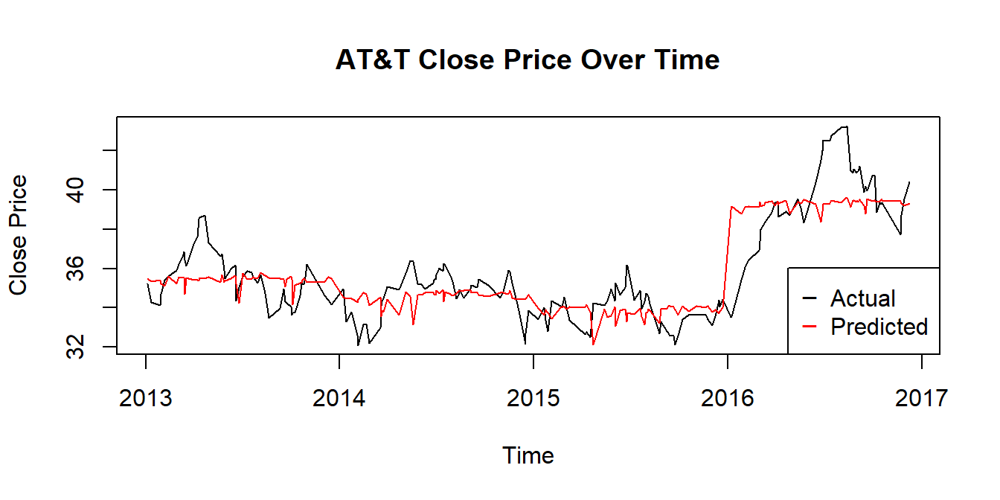

# Analysis to Predict Close Stock Prices from Company AT&T

## Authors:
- Victor Yung 
- Benson Ou-yang 
- Ivan Cao

## Table of Contents
* [Introduction](#introduction)
* [Technologies](#technologies)
* [Setup](#setup)
* [Usage](#usage)
* [Features](#features)

## Introduction
Multiple linear regression analysis to predict Close stock price of AT&T along with an abstract, introduction, data description, methods, results, conclusion and appendix in a report made in R Markdown with Latex.

## Technologies
Project is created with:
* R/R Markdown
* Latex

## Setup
To run this project:
* Download the files [here](https://github.com/bensonouyang/NYStocks.git) in cmd
```sh
git clone https://github.com/bensonouyang/NYStocks.git
```

Required Libraries in R:
* Install the necessary packages

  - lubridate
  ```sh
  install.packages("lubridate")
  ```
  - tidyverse
  ```sh
  install.packages("tidyverse")
  ```
  - faraway
  ```sh
  install.packages("faraway")
  ```
  - caret
  ```sh
  install.packages("caret")
  ```
  - reshape2
  ```sh
  install.packages("reshape2")
  ```
  - car
  ```sh
  install.packages("car")
  ```
  - knitr
  ```sh
  install.packages("knitr")
  ```
  - bookdown
  ```sh
  install.packages("bookdown")
  ```

## Usage
To run the code and see results:
* Open [rawcode.Rmd](https://github.com/bensonouyang/NYStocks/blob/main/rawcode.Rmd) in R Studio

To see the report:
* Open [atntReport.pdf](https://github.com/bensonouyang/NYStocks/blob/main/atntReport.pdf) for PDF version
* Open [atntReport.Rmd](https://github.com/bensonouyang/NYStocks/blob/main/atntReport.Rmd) to see code with report
 
## Features

<p align="center">
  <a href="https://raw.githubusercontent.com/bensonouyang/NYStocks/main/Figs/c-plot-1.png">
    
  </a>
</p>

<p align="center">
  <a href="https://raw.githubusercontent.com/bensonouyang/NYStocks/main/Figs/unnamed-chunk-20-2.png">
    
  </a>
</p>


